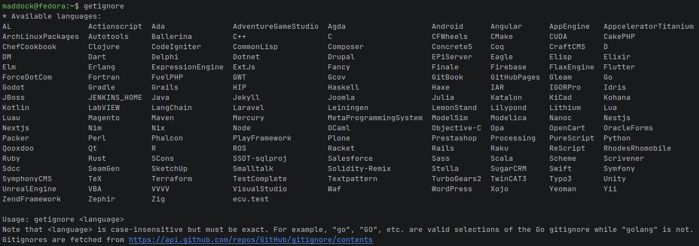
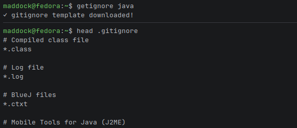

# getignore
Small, simple utility to download [GitHub's .gitignore templates](https://github.com/github/gitignore) to the current directory.

**NOTE:** This is a quick utility I wrote to solve a slight annoyance I was regularly facing. It's definitely NOT production
ready and should be seen just as a simple developer utility. Lots of `panic()`s that shouldn't be used in production!

* [Usage](#usage)
* [Running on Docker](#running-on-docker)
* [Disclaimer](#disclaimer)

## Usage
I recommend compiling this yourself and placing the binary somewhere on your `$PATH`. Assuming the compiled binary name is `getignore`:

* `getignore` will show the program's correct usage and fetch a list of available .gitignore templates



* `getignore <language>` will fetch available templates and download the corresponding template if found



Note that language templates are case-insensitive, meaning `java == JAVA == Java`, etc.

## Running on Docker
This utility can be executed from Docker/Podman if you're on a Linux environment (or any environment targeted by `GOOS=linux`).

If you're using Docker:
```shell
docker run --rm \
  -v "$(pwd):/app" \
  --user "$(id -u):$(id -g)" \
  ghcr.io/sowtag/getignore:master <language>
```

If you're using Podman (note on Fedora/other SELinux-protected systems you must add :Z to the volume mount, leaving you 
with `-v $(pwd):/app:Z`):
```shell
podman run --rm \
  -v "$(pwd):/app" \
  ghcr.io/sowtag/getignore:master <language>
```

## Disclaimer
This utility uses GitHub's anonymous API. Given that the main use I'll give it is very sporadic, I haven't bothered to 
implement things like caching or authentication. This utility is not suitable for usage in bulk/scripts as it will reach 
GitHub's rate limits rather quickly. A decision was made to keep the tool simple.